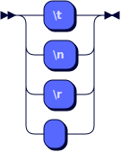

## Grammar (EBNF)

The EBNF (Extended Backus-Naur Form) grammar describes the syntactic structure of the
`Simple Script` language using formal production rules. It defines the different categories
of symbols and the rules for forming expressions and declarations in the language.

**Statement:**


```
Statement
    ::= VarDeclarationStatement
    | AssignmentStatement
    | PrintStatement
```

**VarDeclarationStatement:**


```
VarDeclarationStatement
    ::= 'var' VarDeclaration ( ',' VarDeclaration )*
```

referenced by:

* Statement

**VarDeclaration:**


```
VarDeclaration
    ::= Identifier ( '=' ExpressionList )?
```

referenced by:

* VarDeclarationStatement

**AssignmentStatement:**


```
AssignmentStatement
    ::= Identifier '=' ExpressionList
```

referenced by:

* Statement

**PrintStatement:**


```
PrintStatement
    ::= 'print' ExpressionList
```

referenced by:

* Statement

**ExpressionList:**


```
ExpressionList
    ::= Identifier
    | Number
    | String
    | Boolean
    | ArithmeticOperatorExpression
    | ComparisonOperatorExpression
    | StringOperatorExpression
    | TernaryExpression
```

referenced by:

* AssignmentStatement
* PrintStatement
* VarDeclaration

**ArithmeticOperatorExpression:**


```
ArithmeticOperatorExpression
    ::= ( Number | Identifier ) ( '*' | '+' | '-' | '/' | '%' ) ( Number | Identifier )
```

referenced by:

* ExpressionList

**ComparisonOperatorExpression:**


```
ComparisonOperatorExpression
    ::= ( String | Number | Boolean | Identifier ) ( '==' | '>' | '>=' | '<' | '<=' | '!=' ) ( String | Number | Boolean | Identifier )
```

referenced by:

* ExpressionList

**StringOperatorExpression:**


```
StringOperatorExpression
    ::= ( String | Identifier ) ( '+' | '*' ) ( String | Identifier )
```

referenced by:

* ExpressionList

**TernaryExpression:**


```
TernaryExpression
    ::= Expression '?' ( Expression ':' Expression | TernaryExpression ':' TernaryExpression )
```

referenced by:

* ExpressionList
* TernaryExpression

**Identifier:**


```
Identifier
    ::= [a-zA-Z_] [a-zA-Z0-9_]*
```

referenced by:

* ArithmeticOperatorExpression
* AssignmentStatement
* ComparisonOperatorExpression
* ExpressionList
* StringOperatorExpression
* VarDeclaration

**Number:**


```
Number
    ::= [0-9]+
```

referenced by:

* ArithmeticOperatorExpression
* ComparisonOperatorExpression
* ExpressionList

**String:**


```
String
    ::= '"' [^"]* '"'
    | "'" [^']* "'"
```

referenced by:

* ComparisonOperatorExpression
* ExpressionList
* StringOperatorExpression

**Boolean:**


```
Boolean
    ::= 'false'
    | 'true'
```

referenced by:

* ComparisonOperatorExpression
* ExpressionList

**Whitespace:**


```
Whitespace
    ::= Space
    | Comment
```

**Space:**



```
Space
    ::= '\t'
    | '\n'
    | '\r'
    | ' '
```

referenced by:

* Whitespace

**Comment:**


```
Comment
    ::= CommentSingleLine
    | CommentMultiLine
```

referenced by:

* Whitespace

**CommentSingleLine:**


```
CommentSingleLine
    ::= '//' [^\n]*
```

referenced by:

* Comment


```
CommentMultiLine
    ::= '/*' ( [^*] | '*'+ [^*/] )* '*'* '*/'
```

referenced by:

* Comment

<sup>generated by [RR - Railroad Diagram Generator][RR]</sup>

[RR]: https://rr.red-dove.com/ui
