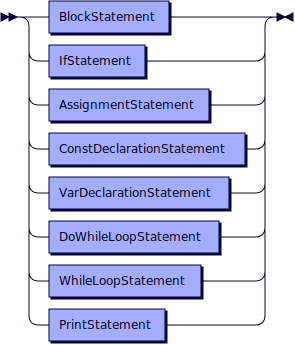
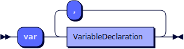
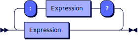
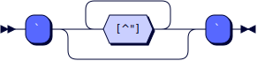
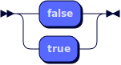
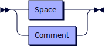
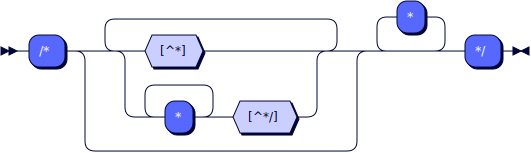

## Grammar (EBNF)

The EBNF (Extended Backus-Naur Form) grammar describes the syntactic structure of the
`Simple Script` language using formal production rules. It defines the different categories
of symbols and the rules for forming expressions and declarations in the language.

**Statement:**



```
Statement
         ::= BlockStatement
           | IfStatement
           | AssignmentStatement
           | ConstDeclarationStatement
           | VarDeclarationStatement
           | DoWhileLoopStatement
           | WhileLoopStatement
           | PrintStatement
```

referenced by:

* BlockStatement

**BlockStatement:**


```
BlockStatement
         ::= Statement+
```

referenced by:

* DoWhileLoopStatement
* IfStatement
* Statement
* WhileLoopStatement

**IfStatement:**


```
IfStatement
         ::= 'if' Expression 'then' BlockStatement ( 'else' 'if' Expression 'then' BlockStatement )+ ( 'else' BlockStatement )? 'end'
```

referenced by:

* Statement

**AssignmentStatement:**


```
AssignmentStatement
         ::= Identifier '=' Expression
```

referenced by:

* Statement

**ConstDeclarationStatement:**


```
ConstDeclarationStatement
         ::= 'const' VariableDeclaration ( ',' VariableDeclaration )*
```

referenced by:

* Statement

**VarDeclarationStatement:**



```
VarDeclarationStatement
         ::= 'var' VariableDeclaration ( ',' VariableDeclaration )*
```

referenced by:

* Statement

**VariableDeclaration:**


```
VariableDeclaration
         ::= Identifier ( '=' Expression )?
```

referenced by:

* ConstDeclarationStatement
* VarDeclarationStatement

**DoWhileLoopStatement:**


```
DoWhileLoopStatement
         ::= 'do' BlockStatement 'while' Expression
```

referenced by:

* Statement

**WhileLoopStatement:**


```
WhileLoopStatement
         ::= 'while' Expression 'then' BlockStatement 'end'
```

referenced by:

* Statement

**PrintStatement:**


```
PrintStatement
         ::= 'print' '(' Expression ')'
```

referenced by:

* Statement

**Expression:**


```
Expression
         ::= TernaryExpression
           | LogicalOrExpression
           | LogicalAndExpression
           | BitwiseOrExpression
           | BitwiseXorExpression
           | BitwiseAndExpression
           | EqualityExpression
           | ComparisonExpression
           | ShiftExpression
           | AdditiveExpression
           | MultiplicativeExpression
           | UnaryExpression
```

referenced by:

* AdditiveExpression
* AssignmentStatement
* BitwiseAndExpression
* BitwiseOrExpression
* BitwiseXorExpression
* ComparisonExpression
* DoWhileLoopStatement
* EqualityExpression
* IfStatement
* LogicalAndExpression
* LogicalOrExpression
* MultiplicativeExpression
* PrimaryExpression
* PrintStatement
* ShiftExpression
* TernaryExpression
* UnaryExpression
* VariableDeclaration
* WhileLoopStatement

**TernaryExpression:**



```
TernaryExpression
         ::= Expression ( '?' Expression ':' Expression )*
```

referenced by:

* Expression

**LogicalOrExpression:**


```
LogicalOrExpression
         ::= Expression ( '||' Expression )*
```

referenced by:

* Expression

**LogicalAndExpression:**


```
LogicalAndExpression
         ::= Expression ( '&&' Expression )*
```

referenced by:

* Expression

**BitwiseOrExpression:**


```
BitwiseOrExpression
         ::= Expression ( '|' Expression )*
```

referenced by:

* Expression

**BitwiseXorExpression:**


```
BitwiseXorExpression
         ::= Expression ( '^' Expression )*
```

referenced by:

* Expression

**BitwiseAndExpression:**


```
BitwiseAndExpression
         ::= Expression ( '&' Expression )*
```

referenced by:

* Expression

**EqualityExpression:**


```
EqualityExpression
         ::= Expression ( ( '==' | '!=' ) Expression )*
```

referenced by:

* Expression

**ComparisonExpression:**


```
ComparisonExpression
         ::= Expression ( ( '<' | '<=' | '>' | '>=' | '<=>' ) Expression )*
```

referenced by:

* Expression

**ShiftExpression:**


```
ShiftExpression
         ::= Expression ( ( '<<' | '>>' ) Expression )*
```

referenced by:

* Expression

**AdditiveExpression:**


```
AdditiveExpression
         ::= Expression ( ( '+' | '-' ) Expression )*
```

referenced by:

* Expression

**MultiplicativeExpression:**


```
MultiplicativeExpression
         ::= Expression ( ( '*' | '/' | '%' ) Expression )*
```

referenced by:

* Expression

**UnaryExpression:**


```
UnaryExpression
         ::= ( '+' | '-' | '!' ) Expression
           | PrimaryExpression
```

referenced by:

* Expression

**PrimaryExpression:**


```
PrimaryExpression
         ::= Identifier
           | Number
           | String
           | StringFormat
           | Boolean
           | '(' Expression ')'
```

referenced by:

* UnaryExpression

**Identifier:**


```
Identifier
         ::= [a-zA-Z_] [a-zA-Z0-9_]*
```

referenced by:

* AssignmentStatement
* PrimaryExpression
* VariableDeclaration

**Number:**


```
Number   ::= [0-9]+
```

referenced by:

* PrimaryExpression

**String:**


```
String   ::= '"' [^"]* '"'
           | "'" [^']* "'"
```

referenced by:

* PrimaryExpression

**StringFormat:**



```
StringFormat
         ::= '`' [^"]* '`'
```

referenced by:

* PrimaryExpression

**Boolean:**



```
Boolean  ::= 'false'
           | 'true'
```

referenced by:

* PrimaryExpression

**Whitespace:**



```
Whitespace
         ::= Space
           | Comment
```

**Space:**


```
Space    ::= '\t'
           | '\n'
           | '\r'
           | ' '
```

referenced by:

* Whitespace

**Comment:**


```
Comment  ::= CommentSingleLine
           | CommentMultiLine
```

referenced by:

* Whitespace

**CommentSingleLine:**


```
CommentSingleLine
         ::= '//' [^\n]*
```

referenced by:

* Comment



```
CommentMultiLine
    ::= '/*' ( [^*] | '*'+ [^*/] )* '*'* '*/'
```

referenced by:

* Comment

<sup>generated by [RR - Railroad Diagram Generator][RR]</sup>

[RR]: https://rr.red-dove.com/ui
