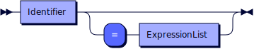
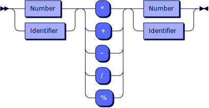
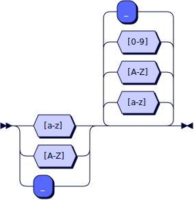

**Statement:**


```
Statement
    ::= VarDeclarationStatement
    | AssignmentStatement
    | PrintStatement
```

**VarDeclarationStatement:**


```
VarDeclarationStatement
    ::= 'var' VarDeclaration ( ',' VarDeclaration )*
```

referenced by:

* Statement

**VarDeclaration:**



```
VarDeclaration
    ::= Identifier ( '=' ExpressionList )?
```

referenced by:

* VarDeclarationStatement

**AssignmentStatement:**


```
AssignmentStatement
    ::= Identifier '=' ExpressionList
```

referenced by:

* Statement

**PrintStatement:**


```
PrintStatement
    ::= 'print' ExpressionList
```

referenced by:

* Statement

**ExpressionList:**


```
ExpressionList
    ::= Identifier
    | Number
    | String
    | Boolean
    | ArithmeticOperatorExpression
    | ComparisonOperatorExpression
    | StringOperatorExpression
```

referenced by:

* AssignmentStatement
* PrintStatement
* VarDeclaration

**ArithmeticOperatorExpression:**



```
ArithmeticOperatorExpression
    ::= ( Number | Identifier ) ( '*' | '+' | '-' | '/' | '%' ) ( Number | Identifier )
```

referenced by:

* ExpressionList

**ComparisonOperatorExpression:**


```
ComparisonOperatorExpression
    ::= ( String | Number | Boolean | Identifier ) ( '==' | '>' | '>=' | '<' | '<=' | '!=' ) ( String | Number | Boolean | Identifier )
```

referenced by:

* ExpressionList

**StringOperatorExpression:**


```
StringOperatorExpression
    ::= ( String | Identifier ) ( '+' | '*' ) ( String | Identifier )
```

referenced by:

* ExpressionList

**Identifier:**



```
Identifier
    ::= [a-zA-Z_] [a-zA-Z0-9_]*
```

referenced by:

* ArithmeticOperatorExpression
* AssignmentStatement
* ComparisonOperatorExpression
* ExpressionList
* StringOperatorExpression
* VarDeclaration

**Number:**


```
Number
    ::= [0-9]+
```

referenced by:

* ArithmeticOperatorExpression
* ComparisonOperatorExpression
* ExpressionList

**String:**


```
String
    ::= '"' ( Letter | Digit | Symbol )* '"'
```

referenced by:

* ComparisonOperatorExpression
* ExpressionList
* StringOperatorExpression

## Credits graph

 <sup>generated by [RR - Railroad Diagram Generator][RR]</sup>

[RR]: https://www.bottlecaps.de/rr/ui
